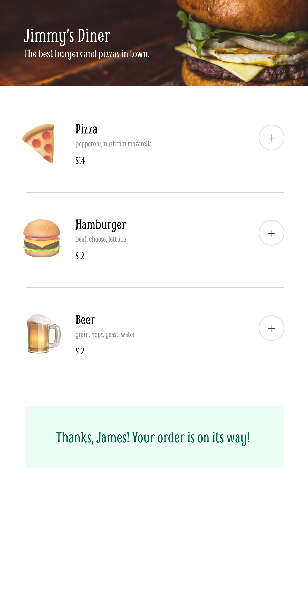

# Mobile Restaurant Menu

Solo project from [Scrimba](https://scrimba.com/). 

Built wit HTML, CSS and JavaScript.

## Preview

The goal of this project was to create an app to order from a restaurant menu.

## Project walkthrough

1. First add items to create an order.
2. If you are happy with the order click "Complete order".
3. Fill out name, credit card number and CVV in order to be able to make the order. After that click "Complete order".
4. Your order has been submitted.
5. Review your experience.